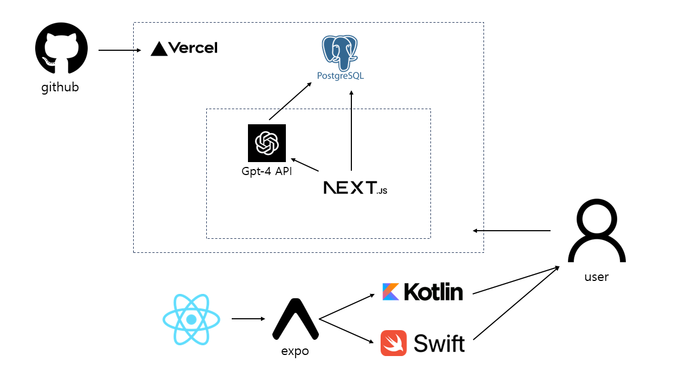

## 팀명

- 쌀국수 🍜
  

## 제출 타입 및 주제

- **C타입. 포스트 코로나 시대의 혼란을 해결하는 SW 개발**

## 프로젝트 한 줄 설명

- 숏폼의 유행으로 인한 자극에서 벗어나 건강한 도파민을 만들도록 도와주는 서비스

## 프로젝트 설명

- 문제 정의
    - 코로나 시대 이후 집에 머무르는 시간이 길어지면서 다양한 동영상 서비스들이 발달하였다.
    - 특히 숏폼의 발달은 사람들이 삶에서 더 큰 자극을 찾도록 만들고 있다.
    - 도파민 중독과 관련된 문제는 현대 사회의 새로운 문제로 떠오른다.
    - 도파민 중독의 원인으로 가장 많이 거론되는 것이 이러한 숏폼의 발달이다.
    - 도파민에 중독된 사람들은 일상의 소소한 행복을 느끼는 데에 어려움을 겪을 것이고, 집중력에 문제가 생겨 ADHD 발병률이 높아질 수 있다.
    - 최근 집중력과 문해력의 문제로 상식이 부족하거나 긴 글을 읽지 못하는 사람들이 증가하고 있다는 것이 문제가 되기도 했다.
    - 또한 도파민 중독에 의한 쾌락주의는 개인의 문제로도 나타나지만, 무기력한 개인의 증가 또는 공격성이 강한 개인들이 모여 사회적 문제를 야기할 수 있다.
    
    

    
- 서비스 의도 및 이름
    - 코로나19로 인한 비대면 사회 도래와 전자기기 사용자가 늘어나면서, 도파민에 중독된 현대인이 스스로 ‘도파민 디톡스’ 할 수 있게 돕는 서비스
    - ‘실제로 움직여서(Do) 건강한 도파민을 얻어내자! (Farming)’는 의미를 담아 ‘도파밍(DoFarming)’이라는 명칭을 붙였다.
    - 도파민 중독에서 벗어나 사람들이 보다 적극적으로 자신의 삶을 살아갈 수 있도록 돕고자 한다.
- 기대 효과
    - 도파민에 중독된 사람들로 하여금 일상생활에서 실천할 수 있는 긍정적인 방향의 목표를 제시하여 건강한 삶을 살아갈 수 있을 것이다.
    - 개인이 주도적으로 삶을 이끌어나가며 건강하고 행복한 삶을 살아갈 수 있다.
    - 건강한 삶을 살아가는 사람들이 늘어난다면, 서로에게 동기를 부여하고 긍정적인 시너지를 내는 효과를 기대할 수 있다.
    - 정보를 얻어가는 시간을 허비하지 않고, 이를 활용해 생산적인 활동을 한다면, 하루하루가 모여 더 나은, 건강한 삶을 살아갈 수 있을 것이다.
    - 현실 속의 자극을 찾아 현실 세계에서 알코올이나 마약, 담배 등을 오남용 하는 문제도 줄일 수 있을 것이다.
    - 사람들의 짧아진 집중력에 의해 발생할 수 있는 ADHD와 같은 질환의 발병률을 낮출 수 있을 것이다.

## 프로젝트에 사용된 기술

### app stack
- Framework - react native
- development tool - expo
- UI library - tamagui
- Graphics Engine - react native skia
- gpt-4 api 

### admin page stack
- Framework - Next.js 13
- Language - TypeScript
- Auth - NextAuth.js
- Database - Vercel Postgres
- Deployment - Vercel
- Styling - Tailwind CSS
- Components - Tremor
- Analytics - Vercel Analytics
- Linting - ESLint
- Formatting - Prettier

## 시연 영상

- https://youtu.be/biONjIrfJxQ?si=omNoNTtosELKHTZe
- 상세 페이지
    - 

## 팀원

### Front-End

| 남소은 | 성민 |
| --- | --- |
| [@2NNS-V](https://github.com/2NNS-V) | [@mini-777](https://github.com/mini-777) |

### Back-End

| 고은샘 | 남지연 |
| --- | --- |
| [@Koeunsaem](https://github.com/Koeunsaem) | [@nJiyeon](https://github.com/nJiyeon) |
